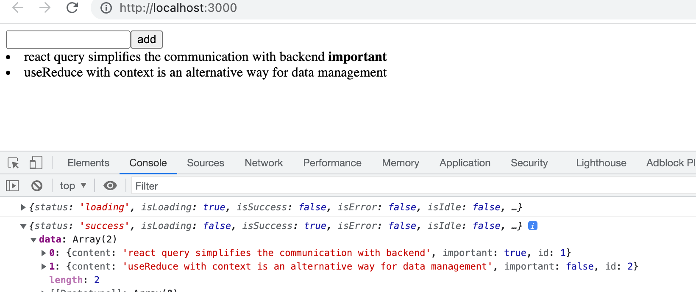

<div class="content">

Tarkastellaan osan lopussa vielä muutamaa erilaista tapaa sovelluksen tilan hallintaan. K

Jatketaan muistiinpano-sovelluksen parissa. Otetaan ensin fokukseen palvelimen kanssa tapahtuva kommunikointi. Aloitetaan sovellus puhtaalta pöydältä. Ensimmäinen versio on seuraava:

```js
const App = () => {
  const addNote = async (event) => {
    event.preventDefault()
    const content = event.target.note.value
    event.target.note.value = ''
    console.log(content)
  }

  const toggleImportance = (note) => {
    console.log('toggle importance of', note.id)
  }

  const notes = []

  return(
    <div>
      <form onSubmit={addNote}>
        <input name="note" />
        <button type="submit">add</button>
      </form>
      {notes.map(note =>
        <li key={note.id} onClick={() => toggleImportance(note)}>
          {note.content} 
          <strong> {note.important ? 'important' : ''}</strong>
        </li>
      )}
    </div>
  )
}

export default App
```

Alkuvaiheen koodi on GitHubissa repositorion [https://github.com/fullstack-hy2020/query-notes](https://github.com/fullstack-hy2020/query-notes/tree/part6-0) branchissa <i>part6-0</i>.

### Palvelimella olevan datan hallinta React Query -kirjaston avulla

Hyödynnämme nyt [Reqct Query](https://react-query-v3.tanstack.com/) -kirjastoa palvelimelta haettavan datan säilyttämiseen ja hallinnointiin. Asennetaan kirjasto komennolla

```bash
npm install react-query
```

Tiedostoon <i>index.js</i> tarvitaan muutama lisäys, jotta kirjaston funktiot saadaan välitettyä koko sovelluksen käyttöön:

```js
import React from 'react'
import ReactDOM from 'react-dom/client'
import { QueryClient, QueryClientProvider } from 'react-query' // highlight-line

import App from './App'

const queryClient = new QueryClient() // highlight-line

ReactDOM.createRoot(document.getElementById('root')).render(
  <QueryClientProvider client={queryClient}> // highlight-line
    <App />
  </QueryClientProvider> // highlight-line
)
```

Voimme nyt hakea muistiinpanot komponentissa <i>App</i>. Koodi laajenee seuraavasti:

```js
import { useQuery } from 'react-query'  // highlight-line
import axios from 'axios'  // highlight-line

const App = () => {
  // ...

   // highlight-start
  const result = useQuery(
    'notes',
    () => axios.get('http://localhost:3001/notes').then(res => res.data)
  )

  console.log(result)
  // highlight-end

  // highlight-start
  if ( result.isLoading ) {
    return <div>loading data...</div>
  }
  // highlight-end

  const notes = result.data  // highlight-line

  return (
    // ...
  )
}
```

Datan hakeneminen palvelimelta tapahtuu edelleen tuttuun tapaan Axiosin <i>get</i>-metodilla. Axiosin metodikutsu on kuitenkin nyt kääritty [useQuery](https://react-query-v3.tanstack.com/reference/useQuery)-funktiolla [muodostetuksi](https://react-query-v3.tanstack.com/guides/queries) kyselymääritykseksi. Funktiokutsin ensimmäisenä parametrina on merkkijono <i>notes</i> joka toimii [avaimena](https://react-query-v3.tanstack.com/guides/query-keys), joka avaimena määriteltyyn kyselyyn, eli muistiinpanojen listaan.

Funktion <i>useQuery</i> paluuarvo on olio, joka kertoo kyselyä vastaavan HTTP-pyynnön tilan. Konsoliin tehty tulostus havainnollistaa tilannetta: 



Eli ensimmäistä kertaa komponenttia renderöitäessä pyyntö on vielä tilassa <i>loading</i>. Tässä vaiheessa renderöidään ainoastaan:

```
<div>loading data...</div>
```

Pyyntö kuitenkin valmistuu niin nopeasti, että tekstiä eivät edes tarkkasilmäisimmät ehdi näkemään. Kun pyyntö valmistuu, renderöidään komponentti uudelleen. Pyyntö on toisella renderöinnillä tilassa <i>success</i>, ja olion kenttä <i>data</i> sisältää halutun datan, joka renderöidä ruudulle.

Sovellus siis hakee datan palvelimelta ja renderöi sen ruudulle käyttämättä ollenkaan luvuissa 2-5 käytettyjä Reactin hookeja <i>useState</i> ja <i>useEffect</i>. Palvelimella oleva data on nyt kokonaisuudessaan React Query -kirjaston hallinnoinnin alaisuudessa, ja sovellus ei tarvitse Reactin <i>useState</i>-hookilla tehtyä tilaa!

Siirretään varsinaisen HTTP-pyynnön tekevä funktio omaan tiedostoonsa <i>requests.js</i>:

```js
import axios from 'axios'

export const getNotes = () =>
  axios.get('http://localhost:3001/notes').then(res => res.data)
```

Komponentti <i>App</i> yksinkertaistuu nyt hiukan

```js
import { useQuery } from 'react-query' 
import { getAnecdotes } from './requests' // highlight-line

const App = () => {
  // ...

  const result = useQuery('notes', getNotes)  // highlight-line

  // ...
}
```

Sovelluksen tämän hetken koodi on [GitHubissa](https://github.com/fullstack-hy2020/query-notes/tree/part6-1) branchissa <i>part6-1</i>.

### Datan vieminen palvelimelle React Queryn avulla

Tehdään tiedostoon <i>requests.js</i> funktio <i>addANote</i> uusien muistiinpanojen talletusta varten:

```js
import axios from 'axios'

const baseUrl = 'http://localhost:3001/notes'

export const getNotes = () =>
  axios.get(baseUrl).then(res => res.data)

export const createNote = newNote => // highlight-line
  axios.post(baseUrl, newNote).then(res => res.data) // highlight-line
```

Komponentti <i>App</i> muuttuu seuraavasti

```js
import { useQuery, useMutation } from 'react-query' // highlight-line
import { getNotes, createNote } from './requests' // highlight-line

const App = () => {
  const newNoteMutation = useMutation(createNote) // highlight-line

  const addNote = async (event) => {
    event.preventDefault()
    const content = event.target.note.value
    event.target.note.value = ''
    newNoteMutation.mutate({ content, important: true }) // highlight-line
  }

  // 

}
```

Uuden muistiinpanon luomista varten määritellään [mutaatio](https://react-query-v3.tanstack.com/guides/mutations) funktion [useMutation](https://react-query-v3.tanstack.com/reference/useMutation) avulla:

```js
const newNoteMutation = useMutation(createNote)
```

Parametrina on tiedostoon <i>requests.js</i> lisäämämme funktio, joka lähettää Axiosin avulla uuden muistiinpanon palvelille.

Tapahtumakäsittelijä <i>addNote</i> kutsuu mutaation funktiota <i>mutate</i>:

```js
newNoteMutation.mutate({ content, important: true })
```

Ratkaisumme on hyvä. Paitsi se ei toimi. Uusi muistiinpano kyllä tallettuu palvelimelle, mutta se ei päivity näytölle. 

Jotta saamme renderöityä myös uuden muistiinpanon, meidän on kerrottava React Querylle, että kyselyn, jonka avaimena on merkkijono notes <i>notes</i> vanha tulos tulee mitätöidä eli
[invalidoida](https://react-query-v3.tanstack.com/guides/invalidations-from-mutations). 

Invalidointi on onneksi helppoa, se voidaan tehdö kytkemällä mutaatioon sopiva <i>onSuccess</i>-takaisinkutsufunktio:

```js
import { useQuery, useMutation, useQueryClient } from 'react-query' // highlight-line
import { getNotes, createNote } from './requests'

const App = () => {
  const queryClient = useQueryClient() 

  const newNoteMutation = useMutation(createNote, {
    onSuccess: () => {  // highlight-line
      queryClient.invalidateQueries('notes')  // highlight-line
    },
  })

  // ...
}
```

Kun mutaatio on nyt suoritettu onnistuneesti, suoritetaan funktiokutsu

```js
queryClient.invalidateQueries('notes')
```

Tämä taas saa aikaan sen, että React Query päivittää automaattisesti kyselyn, jonka avain on  <i>notes</i> eli hakee muistiinpanot palvelimelta. Tämän seurauksena sovellus renderöi uusimman, palvelimella olevan tilan, eli myös lisätty muistiinpano renderöityy.

Toteutetaan vielä muistiinpanojen tärkeyden muutos. Lisätään tiedostoon <i>requests.js</i> muistiinpanojen päivityksen hoitava funktio:

```js
export const updateNote = updatedNote =>
  axios.put(`${baseUrl}/${updatedNote.id}`, updatedNote).then(res => res.data)
```

Myös muistiinpanon päivittäminen tapahtuu mutaation avulla. Komponentti <i>App</i> laajenee seuraavasti:

```js
import { useQuery, useMutation, useQueryClient } from 'react-query' 
import { getNotes, createNot, updateNote } from './requests' // highlight-line

const App = () => {
  // ...

  const updateNoteMutation = useMutation(updateNote, {
    onSuccess: () => {
      queryClient.invalidateQueries('notes')
    },
  })

  const toggleImportance = (note) => {
    updateNoteMutation.mutate({...note, important: !note.important })
  }

  // ...
}
```

Eli jälleen luotiin mutaatio, joka invalidoi kyselyn <i>notes</i> tuloksen, jotta päivitetty muistiinpano saadaan renderöitymään oikien. Mutaation käyttö on helppoa, metodi mutate saa parametrikseen muistiinpanon, jonka tärkeys on vaihdettu vanhan arvon negaatioon.

Sovelluksen tämän hetken koodi on [GitHubissa](https://github.com/fullstack-hy2020/query-notes/tree/part6-2) branchissa <i>part6-2</i>.

### Optimointi

Sovelluksen tämän hetken koodi on [GitHubissa](https://github.com/fullstack-hy2020/query-notes/tree/part6-3) branchissa <i>part6-3</i>.

</div>

<div class="tasks">

### Tehtävät 6.19.-6.21.


</div>

<div class="content">
</div>

<div class="tasks">

### Tehtävät 6.22.-6.24.


</div>
